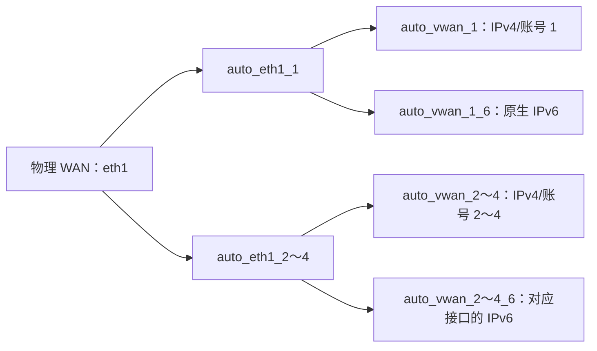

# 磊科 N30 Pro OpenWrt 自编译固件

## 📌 设备信息

| 项目 | 内容 |
|------|------|
| 设备 | 磊科 Netcore N30 Pro |
| OpenWrt 代号 | `netis_nx30v2` |
| 芯片组 | MT7981B + MT7976CN + MT7531AE |
| 接口 | 5×千兆网口 + 1×USB 3.0 |
| 源码分支 | `openwrt-25.12` |

## 🔌 已安装插件

| 插件 | 功能 | 说明 |
|------|------|------|
| LuCI + 中文 | 管理界面 | 简体中文 |
| mwan3 | 多线多拨 | 校园网多拨 |
| syncdial | 同步多拨 | 配合 mwan3 |
| MultiLogin | 自动认证 | 多 WAN 校园网自动登录 |
| UA2F v5.2.0 | HTTP 请求处理 | 包含中文 LuCI 配置页面，默认关闭 |
| iStore | 软件中心 | 使用支持 APK 的上游版本，包含任务管理依赖 |
| OpenClash | 代理 | Firewall4/nftables 模式 |
| OpenList | 文件管理 | OpenList 服务及 LuCI 界面 |

## ⚡ USB 支持

已通过 DTS 补丁修复底层的 USB 硬件支持。
固件已包含 USB 2.0/3.0、USB 存储及 RNDIS/CDC/MBIM/QMI 网络设备支持。

## OpenClash 说明

OpenClash 使用 OpenWrt 25.12 默认的 Firewall4/nftables 后端，不包含旧版 iptables 依赖。固件包含 LuCI 插件及完整运行依赖；首次使用时请在 OpenClash 的版本更新页面选择 `linux-arm64` 并下载 Mihomo 核心。

## UA2F 版本与验证

- 使用 [UA2F 官方 v5.2.0](https://github.com/Zxilly/UA2F/releases/tag/v5.2.0)，移除 UA-Mask 和 UA3F，避免重复处理同一流量。
- 选择 `ua2f` 和 `luci-app-ua2f`。中文页面来自 [lucikap/luci-app-ua2f](https://github.com/lucikap/luci-app-ua2f)，固定到 `abce6b21c88643ead4a88d1a8144ef4813c002fd`，补齐 `luci-compat` 依赖；页面不再自动向外部 HTTP 网站发送检测请求。
- `patches/ua2f-release-build.patch` 修正 v5.2.0 源码中仍标为 4.10.2 的包版本，并采用上游后续的覆盖率开关写法，避免 GitHub CI 强制开启测试覆盖率插桩。关闭可选 libbacktrace 构建，保留普通运行日志。
- 保留上游默认关闭和 NFQUEUE 设置，明确选择 `kmod-nft-queue`、`kmod-nft-tproxy`、`kmod-nf-conntrack-netlink`，与 Firewall4/nftables 配置配套。中文页面提供基础设置；新版本的额外参数仍可通过 UCI 设置。
- 从旧固件升级且保留配置时，检查并停用旧 UA-Mask/UA3F 服务，再单独验证 UA2F。修改 User-Agent 不能保证消除认证平台的“共享或路由器”提示，编译成功也不能代替路由器上的稳定性验证。
- GitHub Actions 检查 `make defconfig` 是否保留 UA2F、iStore、MultiLogin、syncdial、OpenClash、OpenList，随后检查 APK 产物和固件包清单，防止编译成功但插件未装入固件。

## iStore 集成

- iStore 使用 [linkease/istore](https://github.com/linkease/istore) 的固定提交 `a97ace34f2da358a015b094d326bba2697697f2e`，包版本为 `0.2.1-r1`，支持 OpenWrt 25.12 的 APK 包管理。
- 通过独立 `istore` feed 安装 `luci-app-store`、`luci-lib-taskd`、`luci-lib-xterm`、`taskd`，同时保留 `script-utils`、`coreutils-stty`、`libuci-lua`、`mount-utils`、`tar` 等真实依赖。不会改成不存在的通用 `apk` 包依赖，也不会删除 `script-utils` 来绕过依赖问题。
- 软件中心可以在刷机后按需安装插件，但每个插件仍须匹配 OpenWrt 版本、CPU 架构和内核。MultiLogin、UA2F、OpenClash、OpenList 继续预装，不依赖软件中心的目录是否收录。

## 多拨与 OpenClash 启动可靠性

- 固件会为 MultiLogin 应用 `patches/multilogin-auth-check.patch`，每 60 秒按虚拟 WAN 主动检查一次真实校园网认证状态。
- MultiLogin 源码固定到 `fb272e8285c65415dea8a9a359a4204b94be06a0`，与现有认证和 IPv6 补丁匹配；升级到上游 v3 需要单独迁移这些补丁。
- syncdial 从 ImmortalWrt 的 LuCI 目录复制到本地包目录后，修正为引用 `$(TOPDIR)/feeds/luci/luci.mk`，避免相对路径失效而被 `make defconfig` 丢弃。
- 认证检查不再仅依赖 mwan3 的 ping 结果，避免未认证接口仍能 ping 通、却被错误加入负载均衡的问题。
- 已认证状态采用静默检查，避免持续写入 `/var/log/multilogin.log`；掉线、重登与错误仍会正常记录。
- MultiLogin 默认启用，OpenClash 默认延迟 30 秒启动，让 DHCP、多拨和校园网认证先完成。
- OpenClash 默认启用自定义 Fake-IP 过滤，并排除 `login.cqu.edu.cn`，避免 MultiLogin 绑定 WAN 检查时绕过 TUN 却连接到 `198.18.*` Fake-IP。
- OpenClash 停止时会恢复 `223.5.5.5`、`119.29.29.29` 作为 dnsmasq 上游；切换后应清空客户端旧 Fake-IP DNS 缓存。
- MultiLogin 快速配置完成后，`balanced` 策略应只保留已认证的 `auto_vwan_*` 成员；未认证的物理 WAN 会造成随机慢速或 HTTPS 粘滞黑洞。
- 全局 HTTPS 粘滞会把同一客户端固定到单条 WAN，无法聚合多拨带宽；默认保持关闭。
- mwan3 的 HTTPS 规则只匹配 IPv4；IPv6 默认使用主路由表，不能送入仅含 IPv4 成员的 `balanced` 策略。

可在路由器上使用以下命令检查运行状态：

```sh
/etc/init.d/multilogin running
uci -q get multilogin.global.auth_check_interval
uci -q get openclash.config.delay_start
uci -q get openclash.config.custom_fakeip_filter
nslookup login.cqu.edu.cn 127.0.0.1
uci -q get mwan3.balanced.use_member
mwan3 interfaces
```

## 原生 IPv6 与四账号多拨

MultiLogin 的 IPv6 不需要第 5 个校园网账号。每个 `auto_vwan_N_6` 与对应的 IPv4 拨号接口共用 `auto_eth1_N`；它只是同一块 macvlan 上的 DHCPv6 客户端，不会再发起一次门户登录。



- 快速配置会删除 OpenWrt 25.12 的全局 DHCP DUID，避免多个 macvlan 共用同一 DHCP 身份。
- 物理 `wan`/`wan6` 会在创建虚拟 WAN 后禁用，避免未认证物理接口占用会话或进入 mwan3。
- 每个 macvlan 创建对应的 DHCPv6 接口，IPv6 使用独立的 `balanced_v6` 策略；能否获得地址仍取决于上游网络。
- TTL/Hoplimit 防检测只处理从 `br-lan` 转发的非 ICMPv6 客户端流量；RS/RA/NS/NA 等控制报文必须保持 Hop Limit 255。
- 校园网不下发 PD 时，LAN 使用路由器 ULA，`odhcpd` 强制发布默认路由，WAN zone 通过 `masq6` 完成 NAT66。
- OpenClash TUN 可以继续接管 IPv6 做规则判定；命中 `DIRECT` 的流量仍会经 NAT66 从 `auto_vwan_1_6` 原生出口发出。

验证路由器侧配置：

```sh
uci -q get network.globals.dhcp_default_duid
uci -q get network.auto_eth1_1.ipv6
uci -q show network.auto_vwan_1_6
ifstatus auto_vwan_1_6
ip -6 route show default
```

## 🚀 使用方法

### 方式一：GitHub Actions 云编译

向 `main` 推送编译配置、脚本、补丁或工作流改动时会自动启动编译；也可手动启动：

同一分支的新构建会自动取消尚未完成的旧构建，避免继续生成过时配置的固件。

1. Fork 本仓库
2. 进入 Actions 页面
3. 选择 **Build OpenWrt for Netcore N30 Pro**
4. 点击 **Run workflow**
5. 等待编译完成（约 2-4 小时）
6. 在 Releases 中下载固件

## 🔧 默认设置

- 管理地址：使用 OpenWrt 默认设置
- 默认密码：无（首次登录自行设置）

## 📁 文件说明

```
├── .config                           # OpenWrt 编译配置
├── .github/workflows/build-openwrt.yml  # GitHub Actions 工作流
├── patches/multilogin-auth-check.patch  # MultiLogin 真实认证状态检查补丁
├── patches/multilogin-ipv6-uplink.patch # MultiLogin 原生 IPv6 上联补丁
├── patches/ua2f-release-build.patch    # UA2F 版本标记和正式构建修正
├── patches/luci-app-ua2f-compat.patch  # UA2F 中文页面兼容修正
├── diy-part1.sh                      # 编译前脚本（添加第三方源）
├── diy-part2.sh                      # 编译后脚本（DTS补丁+默认设置）
└── README.md                         # 本文件
```

## 🙏 参考

- [磊科N30 Pro OpenWRT刷机及开启USB支持](https://blog.csdn.net/hsyxxyg/article/details/161982524)
- [P3TERX/Actions-OpenWrt](https://github.com/P3TERX/Actions-OpenWrt)
- [OpenWrt 官方](https://openwrt.org/)
