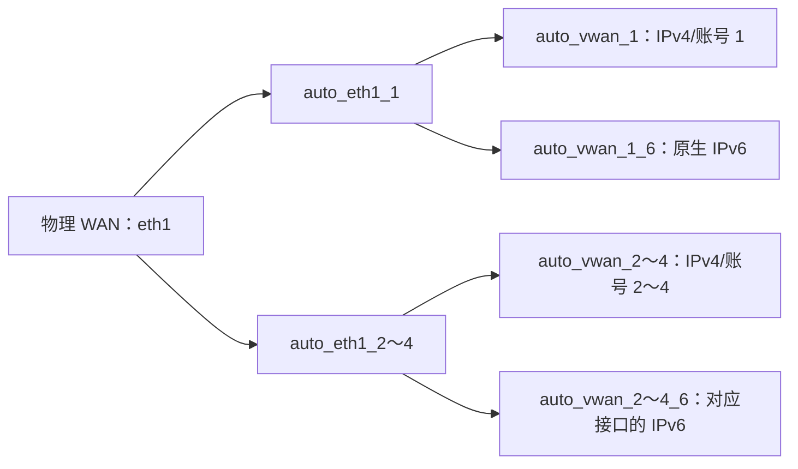

# 磊科 N30 Pro OpenWrt 自编译固件

## 📌 设备信息

| 项目 | 内容 |
|------|------|
| 设备 | 磊科 Netcore N30 Pro |
| OpenWrt 代号 | `netis_nx30v2` |
| 芯片组 | MT7981B + MT7976CN + MT7531AE |
| 接口 | 5×千兆网口 + 1×USB 3.0 |
| 源码分支 | `openwrt-25.12` |

## 🔌 已安装插件

| 插件 | 功能 | 说明 |
|------|------|------|
| LuCI + 中文 | 管理界面 | 简体中文 |
| mwan3 | 多线多拨 | 保留插件，默认关闭服务；单线路使用系统默认路由 |
| MultiLogin | 自动认证 | 多 WAN 校园网自动登录 |
| UA3F v3.6.0 + hev | HTTP UA 改写与 TCP 透明转发 | 自带中文 LuCI；默认开启 LAN IPv4/IPv6 接管 |
| OpenList | 文件列表与存储接入 | 预装服务及 LuCI 页面，固定上游提交 |
| ZeroTier | 虚拟组网 | 预装服务及 LuCI 页面，按需配置 |
| OpenClash | 代理 | Firewall4/nftables 模式；仅预装 MetaCubeXD 控制面板 |
| Samba4 | 局域网文件共享 | USB 磁盘共享与服务发现 |
| SQM | 队列管理 | 按需配置，和硬件流量卸载的兼容性须实机验证 |
| DDNS / UPnP / WOL | 网络辅助 | 动态域名、端口映射、网络唤醒 |
| ttyd | 网页终端 | 保留；统计图表及 collectd 采集组件移除 |
| Package Manager | 原生包管理 | 配合 APK；不预装 iStore |
| Argon / Argon Config | 管理界面主题 | 同时保留 Bootstrap 主题 |

OpenList 和 ZeroTier 预装；iStore、Statistics 及 collectd 采集组件移除。普通共享依赖由当前 feeds 自动解析。完整取舍见 [参考固件软件对照](docs/reference-firmware-packages.md)。

2026-10-02 精简：移除 PassWall、sing-box、geoview、v2ray-geoip、v2ray-geosite、SyncDial；OpenClash 控制面板仅保留 MetaCubeXD。MultiLogin 仍调用 `mwan3 use` 绑定认证出口，保留 mwan3 核心和现有 IPv6 配置。当前路由器卸载预装包只会隐藏只读固件文件；真正增加可写空间需要刷入精简后的固件。见 [精简与实机验证](docs/firmware-trimming.md)。

## ⚡ USB 支持

项目保留现有 USB DTS 补丁；硬件支持是否正常仍须刷机后实测。
固件已包含 USB 2.0/3.0、USB 存储、UAS、ext4/exFAT/NTFS3/VFAT，以及 RNDIS/CDC/MBIM/QMI 和常见 USB 网卡支持。

## OpenClash 说明

OpenClash 使用 OpenWrt 25.12 默认的 Firewall4/nftables 后端，OpenClash 本身不额外引入旧版 iptables 透明代理依赖；mwan3 的兼容依赖仍由上游解析。固件包含 LuCI 插件及完整运行依赖；首次使用时请在 OpenClash 的版本更新页面选择 `linux-arm64` 并下载 Mihomo 核心。默认面板为 MetaCubeXD，打包时排除 Zashboard，不影响 OpenClash 的 LuCI 管理页面。

若可写闪存装不下内核，可启用“小闪存模式”，使用 `/tmp/etc/openclash/core/clash_meta`；内存中的内核在重启后丢失。当前上游手动上传入口仍固定写入 `/etc/openclash/core/`，不能仅打开小闪存模式就认定网页上传成功。

## UA3F 透明代理

- 使用官方 UA3F v3.6.0，源码固定到 `ac39645779823e94628435a2d69cd086a4e4b9fc`，替换 UA2F；不同时安装 UA-Mask。
- 采用 `LAN → nftables TPROXY → hev-socks5-tproxy → UA3F SOCKS5 → 已认证出口`。认证继续由 MultiLogin 负责，路由器自身认证请求不被 LAN 接管。
- 保留 IPv6，分别配置两个地址族的 TPROXY 和策略路由；默认 TCP/443 也转发。HTTPS 不解密，无法据此保证隐藏 UA/TLS 特征或消除共享提示。
- 固定 TTL/Hop Limit、关闭软硬件 flow offloading、拒绝 LAN UDP/443、将 NTP 收敛到路由器；保留 ICMPv6 控制报文。
- UA3F 自带 LuCI 页面；补齐 OpenWrt 25.12 的 `libubox-lua` 等依赖，采用 nftables 依赖。服务停止时撤下关联规则和路由；正常防火墙重载通过同一事务替换规则，保留策略路由。
- OpenClash 插件保留，PassWall 已排除；本透明配置与 OpenClash 独立接管不同时启用。已有代理节点的串联需要另行验证。
- 已完成刷机后 LAN 双栈 TPROXY、明文 UA 改写、TTL/Hop Limit、UDP/443 拒绝和 NTP 重定向实测；发现并修复防火墙重载时的接管空窗。HTTPS 内原始 UA 仍保留。证据和限制见 [升级后的实验记录](docs/ua3f-live-verification.md)。

配置、开关、IPv6 风险和验证边界详见 [UA3F 双栈透明代理配置](docs/ua3f-transparent-profile.md)。

## OpenList、ZeroTier 和包管理

- OpenList 使用 [OpenListTeam/OpenList-OpenWRT](https://github.com/OpenListTeam/OpenList-OpenWRT) 的固定提交 `4bf72661c700d7209e78228f3d3c618443d5b9df`，包含 OpenList 4.2.6 和 LuCI 页面。使用官方 feeds 的 Go 工具链，不覆盖整个 Go feed。
- ZeroTier 服务使用官方 packages feed；LuCI 页面从 ImmortalWrt LuCI 导入，并修正本地包目录的 `luci.mk` 引用。
- 删除 iStore feed、商店页面和专用 taskd 组件；保留原生 APK Package Manager。Statistics 和 collectd 采集组件不预装。
- 以上包选择同时由 `make defconfig` 和最终固件 manifest 检查；实际版本和是否编译成功以该次构建产物为准。

## 多拨与 OpenClash 启动可靠性

- 固件会为 MultiLogin 应用 `patches/multilogin-auth-check.patch`，每 60 秒按配置的 WAN 主动检查一次真实校园网认证状态。
- MultiLogin 源码固定到 `fb272e8285c65415dea8a9a359a4204b94be06a0`，与现有认证和 IPv6 补丁匹配；升级到上游 v3 需要单独迁移这些补丁。
- SyncDial 已移除；虚拟接口快速配置由 MultiLogin 管理，单出口认证继续使用 mwan3 的接口绑定功能。
- 认证守护进程用 netifd 接口上线状态及 IPv4 地址判断上联是否可用，独立于 mwan3 的跟踪服务；关闭负载均衡后仍继续自动认证。请求保留 `mwan3 use` 的接口绑定，避免误用其他 WAN。
- 已认证状态采用静默检查，避免持续写入 `/var/log/multilogin.log`；掉线、重登与错误仍会正常记录。
- MultiLogin 默认启用，OpenClash 默认延迟 30 秒启动，让 DHCP、多拨和校园网认证先完成。
- OpenClash 默认启用自定义 Fake-IP 过滤，并排除 `login.cqu.edu.cn`，避免 MultiLogin 绑定 WAN 检查时绕过 TUN 却连接到 `198.18.*` Fake-IP。
- dnsmasq 仅将 `login.cqu.edu.cn` 加入 DNS 重绑定检查例外，允许校园认证服务器返回私网地址，保留整体保护；这与 OpenClash Fake-IP 排除分别生效，不固定服务器 IP。
- OpenClash 停止时会恢复 `223.5.5.5`、`119.29.29.29` 作为 dnsmasq 上游；切换后应清空客户端旧 Fake-IP DNS 缓存。
- mwan3 插件保留，首次启动默认停止并禁用其负载均衡服务；MultiLogin 快速配置尊重服务开关，不会自行重新启动。单线路保留一条已认证 macvlan 和其 DHCPv6 上联即可。
- 如需手动关闭负载均衡，执行 `/etc/init.d/mwan3 stop` 和 `/etc/init.d/mwan3 disable`，无需删除认证接口。若以后恢复多拨，在“系统 → 启动项”启用并启动 mwan3，并重新核对 IPv4/IPv6 策略和成员；本次实机验证范围为单线路。
- 非 PD 校园网使用 LAN ULA 和 WAN NAT66；DHCPv6 上联设置 `sourcefilter=0`，避免默认路由只匹配 WAN 源地址、导致 LAN 转发和路由器 IPv6 请求无路可走。ICMPv6 控制报文的 Hop Limit 不修改。

可在路由器上使用以下命令检查运行状态：

```sh
/etc/init.d/multilogin running
uci -q get multilogin.global.auth_check_interval
uci -q get openclash.config.delay_start
uci -q get openclash.config.custom_fakeip_filter
uci -q get dhcp.@dnsmasq[0].rebind_domain
uci -q get network.auto_vwan_1_6.sourcefilter
curl -6 -I --connect-timeout 8 --max-time 15 https://www.baidu.com/
nslookup login.cqu.edu.cn 127.0.0.1
uci -q get mwan3.balanced.use_member
mwan3 interfaces
```

## 原生 IPv6 与四账号多拨

MultiLogin 的 IPv6 不需要第 5 个校园网账号。每个 `auto_vwan_N_6` 与对应的 IPv4 拨号接口共用 `auto_eth1_N`；它只是同一块 macvlan 上的 DHCPv6 客户端，不会再发起一次门户登录。



- 快速配置会删除 OpenWrt 25.12 的全局 DHCP DUID，避免多个 macvlan 共用同一 DHCP 身份。
- 物理 `wan`/`wan6` 会在创建虚拟 WAN 后禁用，避免未认证物理接口占用会话或进入 mwan3。
- 每个 macvlan 创建对应的 DHCPv6 接口，IPv6 使用独立的 `balanced_v6` 策略；能否获得地址仍取决于上游网络。
- TTL/Hoplimit 防检测只处理从 `br-lan` 转发的非 ICMPv6 客户端流量；RS/RA/NS/NA 等控制报文必须保持 Hop Limit 255。
- 校园网不下发 PD 时，LAN 使用路由器 ULA，`odhcpd` 强制发布默认路由，WAN zone 通过 `masq6` 完成 NAT66。
- OpenClash TUN 可以继续接管 IPv6 做规则判定；命中 `DIRECT` 的流量仍会经 NAT66 从 `auto_vwan_1_6` 原生出口发出。

验证路由器侧配置：

```sh
uci -q get network.globals.dhcp_default_duid
uci -q get network.auto_eth1_1.ipv6
uci -q show network.auto_vwan_1_6
ifstatus auto_vwan_1_6
ip -6 route show default
```

## 🚀 使用方法

### 方式一：GitHub Actions 云编译

向 `main` 推送编译配置、脚本、补丁或工作流改动时会自动启动编译；也可手动启动：

同一分支的新构建会自动取消尚未完成的旧构建，避免继续生成过时配置的固件。

1. Fork 本仓库
2. 进入 Actions 页面
3. 选择 **Build OpenWrt for Netcore N30 Pro**
4. 点击 **Run workflow**
5. 等待编译完成（约 2-4 小时）
6. 在 Releases 中下载固件

## 🔧 默认设置

- 管理地址：使用 OpenWrt 默认设置
- 默认密码：无（首次登录自行设置）

## 📁 文件说明

```
├── .config                           # OpenWrt 编译配置
├── .github/workflows/build-openwrt.yml  # GitHub Actions 工作流
├── patches/multilogin-auth-check.patch  # MultiLogin 真实认证状态检查补丁
├── patches/multilogin-ipv6-uplink.patch # MultiLogin 原生 IPv6 上联补丁
├── patches/ua3f-openwrt-nft.patch      # UA3F nftables/LuCI/服务管理适配
├── files/                            # 双栈透明接管和首次启动配置
├── docs/ua3f-transparent-profile.md   # UA3F 使用及验证说明
├── diy-part1.sh                      # 编译前脚本（添加第三方源）
├── diy-part2.sh                      # 编译后脚本（DTS补丁+默认设置）
└── README.md                         # 本文件
```

## 🙏 参考

- [磊科N30 Pro OpenWRT刷机及开启USB支持](https://blog.csdn.net/hsyxxyg/article/details/161982524)
- [P3TERX/Actions-OpenWrt](https://github.com/P3TERX/Actions-OpenWrt)
- [OpenWrt 官方](https://openwrt.org/)
