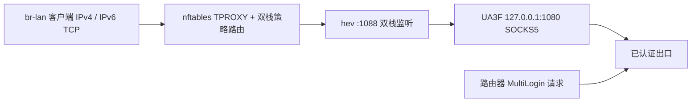

# UA3F 双栈透明代理配置

本版认证仍由 MultiLogin 完成；mwan3 保留但默认关闭，单条认证 macvlan、DHCPv6、LAN ULA/NAT66 和认证域名 DNS 例外继续使用已有配置。OpenList、ZeroTier 保留；iStore 和 Statistics/collectd 不预装。

参考 [Looking4U 的配置文章](https://lucky-z.fun/p/1e43e556.html) 的 SOCKS5 转发思路，使用 [UA3F v3.6.0](https://github.com/SunBK201/UA3F/releases/tag/v3.6.0) 和 OpenWrt 官方 feeds 的 [hev-socks5-tproxy](https://github.com/heiher/hev-socks5-tproxy)。文章的关闭 IPv6、排除 TCP/443 做法没有直接照搬：本项目延续用户的 IPv6 访问需求，默认接管两个地址族的 TCP，包括 443；可以在 UA3F 页面关闭 443 转发以减少 CPU 开销。

## 流量路径和范围



- 只接管 `br-lan` 入站流量，路由器自己的认证、DNS 和 UA3F 出站连接不会再次进入这套接管规则。
- 排除路由器本地地址、LAN 连接路由、链路本地和组播地址。LAN 网段从运行时路由读取，不固定为 `192.168.1.0/24`，也不整体排除校园网 `10.0.0.0/8` 或 `fc00::/7`。
- 排除 `198.18.0.0/15` Fake-IP 地址；这不是完整的 OpenClash 联动方案。
- IPv4/IPv6 UDP/443 拒绝，支持回退的应用可改用 TCP。其他 UDP 不经 UA3F；关闭 QUIC 不等于所有应用都会回退。
- LAN UDP/123 重定向到路由器，启用本地 NTP 服务。
- 保留已有 TTL/Hop Limit 64 规则，ICMPv6 控制报文不改；明确关闭软件和硬件 flow offloading。
- 默认使用文章中的 Chrome 124 UA 示例，可在页面改为自己实际使用的浏览器 UA；不用 `FFF` 或拼接应用尾巴。

## IPv6 能力和限制

IPv6 的风险取决于它是否绕过接管规则。IPv4-only 的代理配合客户端 IPv6，会留下直连路径；本版分别添加 IPv4 和 IPv6 的 TPROXY、fwmark 路由与本地路由，并用 hev 的双栈透明监听处理原始目的地址。

UA3F v3.6.0 的原生 TPROXY 服务器在 `internal/server/tproxy/tproxy_linux.go` 中固定监听 `0.0.0.0`。本版使用 SOCKS5 + hev，不依赖该原生监听处理 IPv6。SOCKS5 的入口是 IPv4 环回地址，但 SOCKS5 请求能携带 IPv6 目的地址，这不会将 IPv6 出站转换为 IPv4。

没有开启 TLS 中间人解密（MITM），不需要安装自签 CA。HTTPS 经过 UA3F 时会重新建立出口 TCP，但 TLS 数据仍原样传递，HTTPS 内的 UA、TLS 指纹、应用行为和并发连接不能因此全部统一。NAT66 也不代表匿名。不得把编译成功或双栈访问成功当成“不会再提示共享”的证明。

## 开关与升级

首次启动设置 `ua3f.enabled.enabled=1`、`ua3f.main.server_mode=SOCKS5`、`ua3f.main.transparent_proxy=1`、`ua3f.main.proxy_https=1`。UA3F 自带 LuCI 页面，位于服务菜单；无需另装 `luci-app-ua3f`。

在 UA3F 页面关闭总开关或 LAN 双栈透明代理开关，再保存应用，会停止关联的 hev 实例并删除本项目 nft 表和两个地址族的策略路由。总服务开着但透明代理关闭时，UA3F 仍可作为本地 SOCKS5 使用。

```sh
# 仅关闭本版透明接管，保留本地 SOCKS5
uci set ua3f.main.transparent_proxy='0'
uci commit ua3f
/etc/init.d/ua3f restart

# 重新开启本版透明接管
uci set ua3f.main.transparent_proxy='1'
uci commit ua3f
/etc/init.d/ua3f restart
```

此配置保留 IPv6。关闭 UA3F 不会自动关闭 IPv6；如需 IPv4-only 方案，应另行关闭 LAN 的 IPv6 通告、上联及转发，不能仅删掉 IPv6 接管规则。

从旧版保留配置升级时，首次启动会停用残留 UA2F/UA-Mask 和独立 hev 启动项。hev 由 UA3F 的 procd 服务管理，不要再单独开启上游 hev 服务。改动服务端口会同步生成 hev 的 SOCKS5 上游端口；1088 保留给透明监听。

OpenClash、PassWall 的插件和已有配置继续保留。如果其中一套独立接管已经启用，或 flow offloading 打开，本版 helper 会拒绝启动透明接管并记录原因，UA3F 本地 SOCKS5 仍可运行。先只启用一套接管；若要与代理节点组合，必须单独设计并验证 SOCKS5 串联，不能假定两套透明代理同时打开就会按预期串联。

## 检查方式

```sh
uci -q get ua3f.enabled.enabled
uci -q get ua3f.main.server_mode
uci -q get ua3f.main.transparent_proxy
uci -q get ua3f.main.proxy_https
/etc/init.d/ua3f running
logread -e ua3f-tproxy
nft list table inet n30pro_ua3f
ip -4 rule show
ip -6 rule show
ip -4 route show table 31001
ip -6 route show table 31001
uci -q get firewall.@defaults[0].flow_offloading
uci -q get firewall.@defaults[0].flow_offloading_hw
```

正常启用时应看到两个地址族的 TPROXY 规则、`fwmark 0x1000000/0xff000000`、路由表 31001 的 local 路由；IPv4 与 IPv6 计数应随实际测试请求增长。路由器自身 `curl -6` 不经过 LAN 接管链，不能代替 LAN 端验证。客户端测试时应关闭或绕开客户端代理/TUN，并确认请求从连接路由器的接口发出。

正常防火墙重载保持已有策略路由，通过同一个 `nft -f` 事务删除并替换本项目表；新规则检查或加载失败时保留旧表。只有明确停止、关闭透明配置或发现不兼容配置时才清理接管。本版没有实现代理尚未启动或被主动停止时的强制断网策略。

编译前已完成 shell/YAML/LuCI 语法、服务启停及异常回滚的模拟检查；规则已通过现有路由器 `nft -c`。校验官方发布包 SHA256 后，在路由器临时端口运行 UA3F/hev，确认双栈透明监听以及 UA3F SOCKS5 到 IPv4、IPv6 HTTPS 的 200 响应；测试结束停止临时进程，没有应用新接管规则。刷机后的完整 LAN TPROXY 路径、明文 HTTP UA 改写、重启/防火墙重载、吞吐和长期稳定性仍待实测。

2026-10-02 升级后已补充完整 LAN 路径测试，结果和重载空窗修复详见 [实机实验记录](ua3f-live-verification.md)。吞吐、代理服务重启期间的行为、整机重启和长期稳定性未据此验证。

GitHub Actions 检查 defconfig、APK 产物和 manifest，要求 UA3F、hev、LuCI 兼容依赖及保留的应用装入固件，拒绝 UA2F、UA-Mask、iStore 和 Statistics/collectd。
